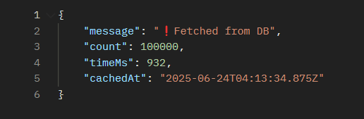
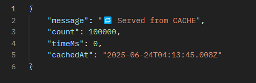

# ⚡ MongoDB Performance Test - Redis Caching (NestJS)

This project demonstrates how to cache MongoDB responses using **Redis** with **NestJS's CacheModule**, significantly improving response time on repeated API calls.

---

## 📦 Tech Stack

- **NestJS**
- **MongoDB (Mongoose)**
- **Redis**
- **`@nestjs/cache-manager` + `cache-manager-ioredis`**

---

## 🐳 Docker Setup (MongoDB + Redis)

```yaml
version: '3.8'

services:
  mongodb:
    image: mongo:6.0
    container_name: nest_mongo
    ports:
      - '27017:27017'
    volumes:
      - mongo_data:/data/db

  redis:
    image: redis:latest
    container_name: my-redis
    ports:
      - "6379:6379"
    volumes:
      - redis-data:/data

volumes:
  mongo_data:
  redis-data:
````

Start the containers:

```bash
docker-compose up -d
```

---

## 📁 Folder Structure

```
src/
├── app.module.ts               # Registers Redis cache + global interceptor
├── data/
│   ├── data.module.ts          # Mongoose feature module
│   ├── data.controller.ts      # Endpoint with manual Redis cache logic
│   └── schema/
│       └── user.schema.ts      # Mongoose schema
```

---

## 🧬 User Schema

📄 `src/data/schema/user.schema.ts`

```ts
import { Prop, Schema, SchemaFactory } from '@nestjs/mongoose';
import { Document } from 'mongoose';

@Schema()
export class User extends Document {
  @Prop()
  userId: number;

  @Prop()
  name: string;

  @Prop()
  timestamp: Date;
}

export const UserSchema = SchemaFactory.createForClass(User);
```

---

## 🚀 AppModule with Redis Cache

📄 `src/app.module.ts`

```ts
import { Module, OnModuleInit } from '@nestjs/common';
import { MongooseModule, InjectConnection } from '@nestjs/mongoose';
import { CacheModule, CacheInterceptor } from '@nestjs/cache-manager';
import { APP_INTERCEPTOR } from '@nestjs/core';
import * as redisStore from 'cache-manager-ioredis';
import { DataModule } from './data/data.module';
import { Connection } from 'mongoose';

@Module({
  imports: [
    CacheModule.registerAsync({
      isGlobal: true,
      useFactory: () => ({
        store: redisStore,
        host: 'localhost',
        port: 6379,
        ttl: 60,
      }),
    }),
    MongooseModule.forRootAsync({
      useFactory: () => ({
        uri: 'mongodb://localhost:27017/testdb',
        connectionFactory: (connection) => {
          connection.on('connected', () => console.log('🟩 Mongo connected'));
          connection.on('error', (err) => console.error('🟥 Mongo error:', err));
          connection.on('disconnected', () => console.warn('🟧 Mongo disconnected'));
          return connection;
        },
      }),
    }),
    DataModule,
  ],
  providers: [
    {
      provide: APP_INTERCEPTOR,
      useClass: CacheInterceptor,
    },
  ],
})
export class AppModule implements OnModuleInit {
  constructor(@InjectConnection() private readonly connection: Connection) {}

  onModuleInit() {
    const states = ['Disconnected', 'Connected', 'Connecting', 'Disconnecting'];
    console.log(`📡 Mongoose state: ${states[this.connection.readyState]}`);
  }
}
```

---

## 📡 Redis-Cached Endpoint

📄 `src/data/data.controller.ts`

```ts
import { Controller, Get, Inject } from '@nestjs/common';
import { InjectModel } from '@nestjs/mongoose';
import { User } from './schema/user.schema';
import { Model } from 'mongoose';
import { CACHE_MANAGER } from '@nestjs/cache-manager';
import { Cache } from 'cache-manager';

@Controller('data/redis')
export class DataController {
  constructor(
    @InjectModel(User.name) private readonly userModel: Model<User>,
    @Inject(CACHE_MANAGER) private readonly cacheManager: Cache,
  ) {}

  @Get('cache')
  async getWithManualCache() {
    const start = Date.now();

    const cacheKey = 'user_data_manual_cache';
    let data = await this.cacheManager.get<User[]>(cacheKey);

    let fromCache = true;

    if (!data) {
      console.log('❗Fetching from DB...');
      data = await this.userModel.find().exec();
      await this.cacheManager.set(cacheKey, data, 60); // cache for 60s
      fromCache = false;
    }

    const end = Date.now();

    return {
      message: fromCache ? '🔁 Served from CACHE' : '❗Fetched from DB',
      count: data.length,
      timeMs: end - start,
      cachedAt: new Date().toISOString(),
    };
  }
}
```

---

## ▶️ Run the App

```bash
npm install
npm run start:dev
```

---

## 🌐 Test the API

```
GET http://localhost:3000/data/redis/cache
```

---

## ✅ Sample Output

### First request (no cache yet):



### Second request (instant cache hit):


